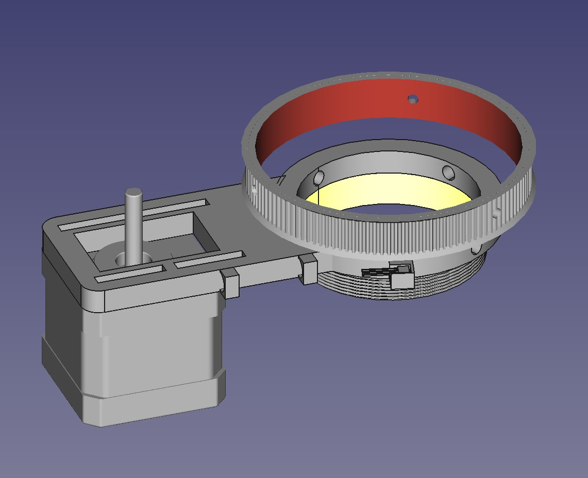

# Firmware

## Harware
- D1 Mini NodeMCU ESP8266EX WLAN [Example](https://www.amazon.com/Hosyond-Wireless-Internet-Development-Compatible/dp/B09SPYY61L/ref=sr_1_4?crid=T5XAT2KD40YJ&keywords=D1+Mini+NodeMCU&qid=1676701799&sprefix=d1+mini+nodemcu%2Caps%2C229&sr=8-4)
- M42/M48/M54/M68 CAA 360 ° Rotator Camera Angle Adjuster [Like this](https://www.aliexpress.com/item/1005003073444446.html?spm=a2g0o.order_list.0.0.15e51802Ujoaqm)
- HALL Sensor A3144 (Auto Home)
- TMC2209 Driver
- NEMA17 Stepper - 0.9/1.8 doesnt matter

---

Create a file `arduino_secrets.h` and add the following

```
#ifndef ARDUINO_SECRETS_H
#define ARDUINO_SECRETS_H

#define _SSID ""
#define _PASSWORD ""
#define _HOSTNAME "TCNRotator"

#endif
```

